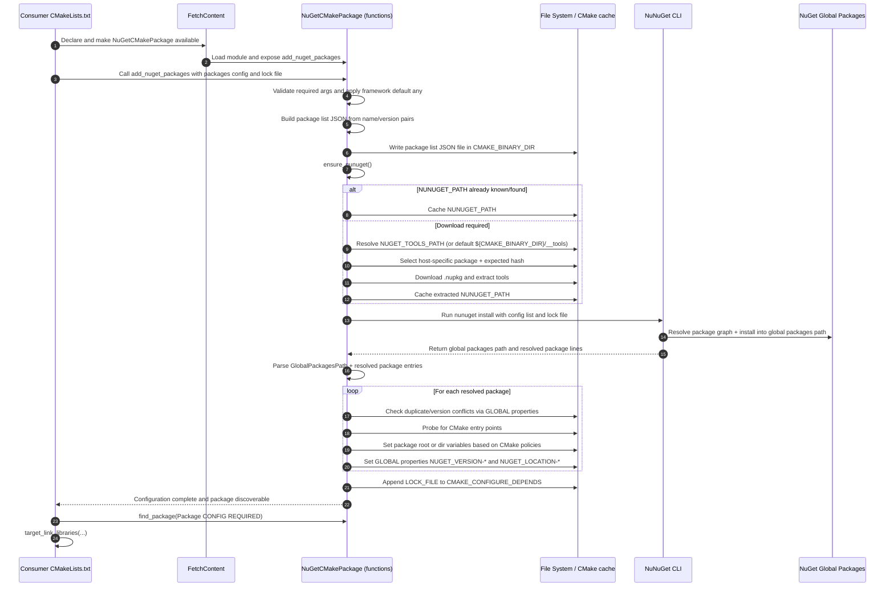

# End-to-end flow (implementation sequence)

## Index

- [Prerequisites](#prerequisites)
- [Flow](#flow)
- [Outputs](#outputs)

## Prerequisites

This sequence shows how the implementation in `CMakeLists.txt` resolves and exposes NuGet packages for `find_package`.

## Flow

## Outputs

- Resolved NuGet packages installed into the global packages path.
- Package discovery variables set for `find_package` (`*_ROOT` or `*_DIR`, policy-dependent).
- Global properties set for installed package version and location (`NUGET_VERSION-*`, `NUGET_LOCATION-*`).
- Lock file added to `CMAKE_CONFIGURE_DEPENDS` so configuration reruns when the lock file changes.
